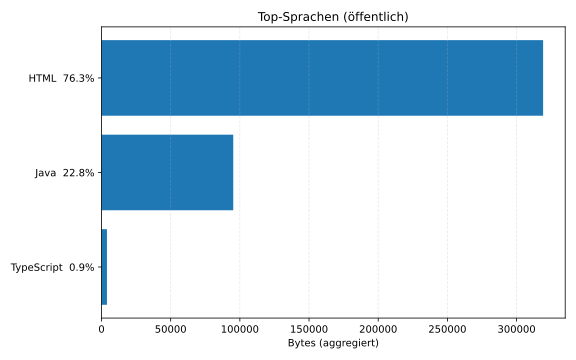
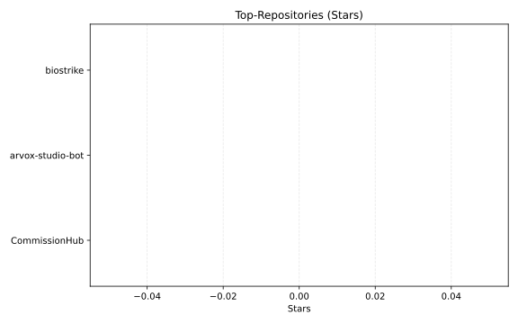

<!-- Banner -->

  <picture>
    <source media="(prefers-color-scheme: light)" srcset="06c5c296-849d-4ba3-b3cd-cd7f7624b58c.png">
    
  </picture>

<!-- Intro -->
<table align="center">
  <tr>
    <td width="150" align="center" valign="top">
      
    </td>
    <td valign="middle">
      <h2>Hi, ich bin Mike 👋</h2>
      
Ich entwickle <b>Game‑Backends und Tools</b> – vom Prototyp bis zum Live‑Service – mit Fokus auf <b>Stabilität</b>, <b>Automatisierung</b> und <b>praktische KI‑Features</b>.

    </td>
  </tr>
</table>

---

## 🎯 Fokus
- Server‑authoritative Backends für Auth, Matchmaking, Stats/Events & Economy
- Worker‑/Queue‑basierte Orchestrierung für skalierbare Live‑Features
- Telemetrie & Robustheit: Observability, Feature Flags, sichere Deployments
- KI‑gestützte Workflows im Betrieb

---

## 📈 Visuals

  
  

---

## 🚀 Projekte
<!-- start: projects-list -->

<table>
<tr><td align="left" width="50%" valign="top"><a href="https://github.com/PixelGG/CommissionHub"><b>CommissionHub</b></a> Player-driven contract marketplace with built-in economy, jobs and addon support. ⭐ 0 · Java · updated 2025-11-19</td><td align="left" width="50%" valign="top"><a href="https://github.com/PixelGG/arvox-studio-bot"><b>arvox-studio-bot</b></a> Modularer Discord-Bot für den Arvox Studio Server: Onboarding, Self-Roles, Tickets mit HTML-Transkripten, Voice-Support… ⭐ 0 · TypeScript · updated 2025-11-19</td></tr>
<tr><td align="left" width="50%" valign="top"><a href="https://github.com/PixelGG/biostrike"><b>biostrike</b></a> Server-authoritative, turn-based tactics game focusing on plant creatures, weather and ecology mechanics. ⭐ 0 · TypeScript · updated 2025-11-18</td><td width="50%"></td></tr>
</table>

<!-- end: projects-list -->

  
<b>Alle öffentlichen Repositories</b>

  <!-- start: all-repos-list -->

- <a href="https://github.com/PixelGG/CommissionHub"><code>CommissionHub</code></a> — ⭐ 0 · Java · updated 2025-11-19
- <a href="https://github.com/PixelGG/arvox-studio-bot"><code>arvox-studio-bot</code></a> — ⭐ 0 · TypeScript · updated 2025-11-19
- <a href="https://github.com/PixelGG/biostrike"><code>biostrike</code></a> — ⭐ 0 · TypeScript · updated 2025-11-18

<!-- end: all-repos-list -->

---

## 🛠️ Tech‑Stack

  

---

## 📫 Kontakt

