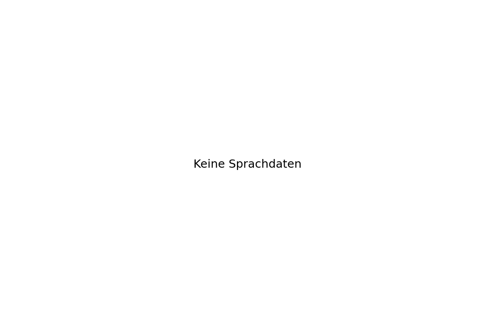
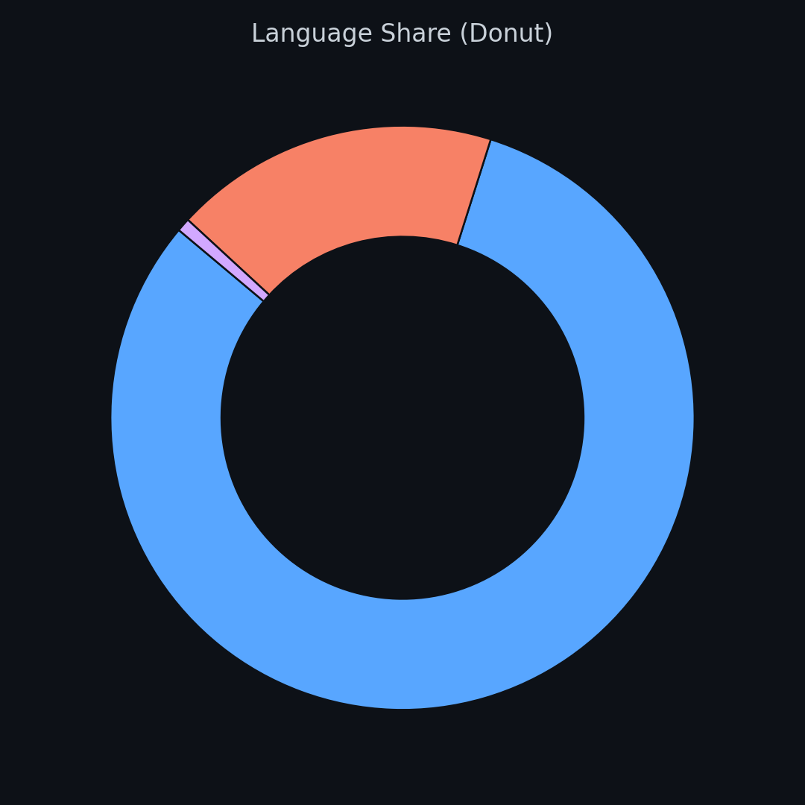

<!-- Banner -->

  <picture>
    <source media="(prefers-color-scheme: light)" srcset="06c5c296-849d-4ba3-b3cd-cd7f7624b58c.png">
    
  </picture>

<!-- Intro / Hero -->
<table align="center">
  <tr>
    <td width="150" align="center" valign="top">
      
    </td>
    <td valign="middle">
      <h2>Hi, ich bin Mike 👋</h2>
      

        Ich baue <b>Game-Backends, Tools und Automatisierung</b> – von Prototypen bis Live-Services –
        mit Fokus auf <b>Stabilität</b>, <b>saubere Infrastruktur</b> und <b>praktische KI-Features</b>.
      

      

        <code>Auth</code> · <code>Matchmaking</code> · <code>Stats</code> · <code>Queues</code> · <code>APIs</code>
      

    </td>
  </tr>
</table>

  
  
  

---

## 🔎 Snapshot

  <!-- start: metrics-summary -->
  Lädt…
  <!-- end: metrics-summary -->

---

## 🧩 Woran ich arbeite

<table>
  <tr>
    <td width="33%" valign="top">
      <b>🎮 Game-Backends</b> 
      Server-authoritative Systeme für Auth, Matchmaking, Stat-Tracking & Economy – mit Blick auf Live-Operations.
    </td>
    <td width="33%" valign="top">
      <b>🤖 Automatisierung & Bots</b> 
      Discord-Bots, Worker und kleine Services, die CI/CD, Monitoring und Community-Workflows abnehmen.
    </td>
    <td width="33%" valign="top">
      <b>🧠 KI im Alltag</b> 
      KI-gestützte Tools, die Code, Ops und Game-Tools unterstützen – nicht als Gimmick, sondern als echtes Werkzeug.
    </td>
  </tr>
</table>

---

## 🚀 Projekte

  <b>Aktuell aktiv</b> 
  Zuletzt geänderte Repositories (Top 6, automatisch generiert).

<!-- start: projects-latest -->

  <!-- Automatisch erzeugt -->

<!-- end: projects-latest -->

 

  <b>Beliebt</b> 
  Repositories mit den meisten Stars (Top 6, automatisch generiert).

<!-- start: projects-stars -->

  <!-- Automatisch erzeugt -->

<!-- end: projects-stars -->

---

## 🛠️ Tech-Stack

  <b>Core & Scripting</b> 
  

  <b>Backend & Daten</b> 
  

  <b>Build, Infra & Automation</b> 
   
  <code>YAML</code> für Pipelines & Configs

---

## 📊 Tech-Insights

  
  

---

## 🎯 Aktueller Fokus

<table>
  <tr>
    <td width="50%" valign="top">
      <b>🔐 Live-Backends für Games</b>
      <ul>
        <li>Auth & Session-Handling</li>
        <li>Matchmaking & Instancing</li>
        <li>Stats, Events & Progression</li>
      </ul>
    </td>
    <td width="50%" valign="top">
      <b>⚙️ Dev-Automation & Tools</b>
      <ul>
        <li>Services & Bots für CI/CD & Monitoring</li>
        <li>Discord-Integration für Studio & Community</li>
        <li>KI-unterstützte Workflows für Devs & Ops</li>
      </ul>
    </td>
  </tr>
</table>

---

## 📫 Kontakt

  

