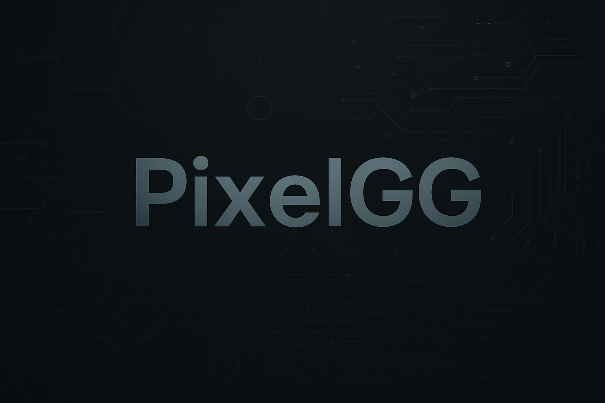

<!-- Banner -->

  

<h1 align="center">Hi, I'm Mike 👋</h1>

  A passionate developer who loves building game‑related tools and backend systems. 
  I enjoy automating workflows and exploring modern software technologies.

## 🚀 Projects & Highlights

- **CitizenSync** – Keeps your Star Citizen data synchronized across various tools.  
- **HLL‑RCONBOT** – Automates server administration for *Hell Let Loose*.  
- **Ikarus‑Ki** – Experiments with game AI and machine learning.

## 🛠️ Skills & Tools

  
  
  
  
  
  
  
  

## 📊 GitHub Stats

   
   
  

## 📫 How to Reach Me

Feel free to open an [issue](https://github.com/PixelGG/PixelGG/issues) or start a [discussion](https://github.com/PixelGG/PixelGG/discussions) if you want to get in touch.
