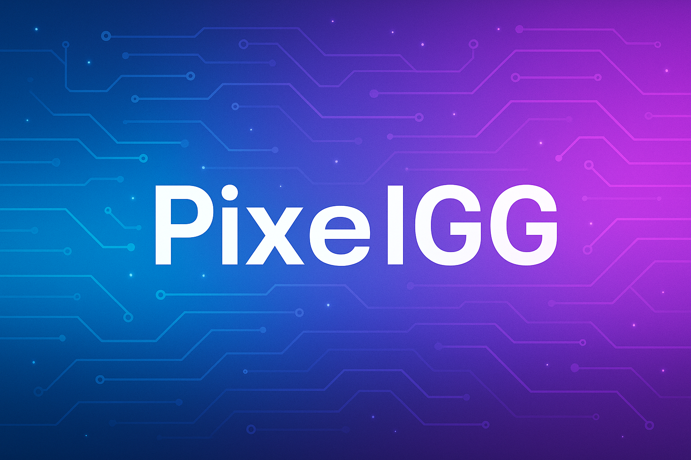

<!-- Banner -->

  

<!-- Profile summary with avatar and intro -->
<table align="center">
  <tr>
    <td width="170" align="center">
      
    </td>
    <td style="text-align: left;">
      <h2>Hi, I’m Mike 👋</h2>
      
Software enthusiast building game‑related tools and backend systems. I enjoy automation, AI, and open source.

      

        
      

    </td>
  </tr>
</table>

<!-- GitHub statistics -->
<table align="center">
  <tr>
    <td align="center" width="50%">
      
    </td>
    <td align="center" width="50%">
      
    </td>
  </tr>
  <tr>
    <td colspan="2" align="center">
      
    </td>
  </tr>
</table>

<!-- Trophy section -->

  

<!-- Contribution graph -->

  

## 🚀 Projects

| Project       | Description                                                                       | Technologies             |
|---------------|-----------------------------------------------------------------------------------|--------------------------|
| **CitizenSync** | Synchronises your Star Citizen data across various tools and platforms.            | Python, SQL              |
| **HLL‑RCONBOT** | Automates server administration for *Hell Let Loose*.                             | Node.js, TypeScript      |
| **Ikarus‑Ki**  | Experiments with game AI and machine learning.                                    | C++, Python, ML          |

## 🔨 Tech Stack

  
  
  
  
  
  
  
  

## 🧠 Currently Learning

I’m diving deeper into:

- Advanced AI frameworks and orchestration tools.
- Modern web frameworks like Next.js and Flutter.

## 📫 Get in Touch

If you’d like to discuss projects, collaborations or just say hello, feel free to open an [issue](https://github.com/PixelGG/PixelGG/issues) or start a [discussion](https://github.com/PixelGG/PixelGG/discussions). I look forward to connecting with you!
