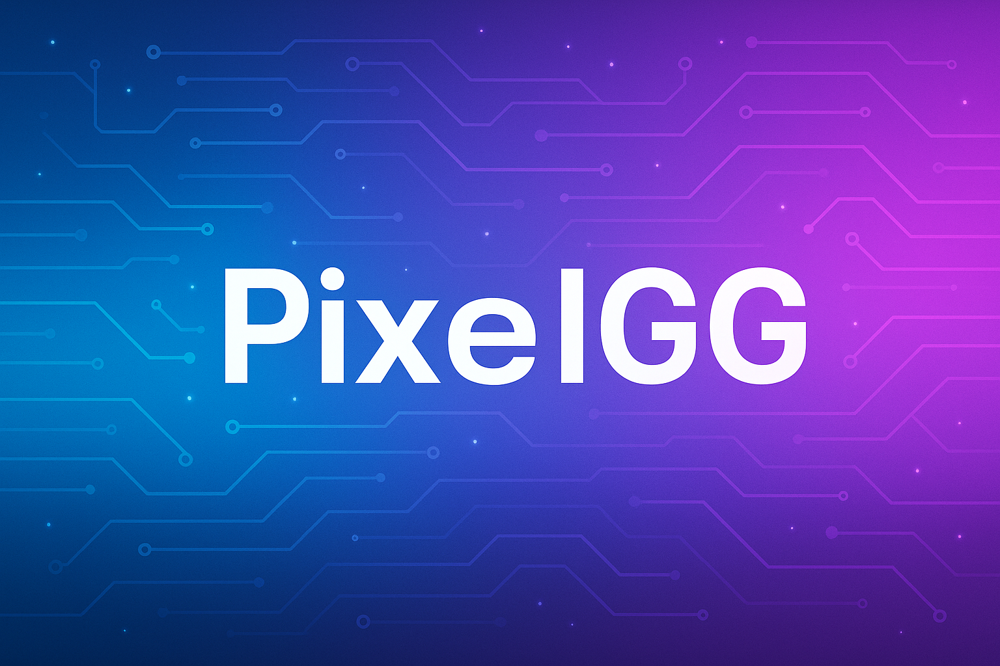
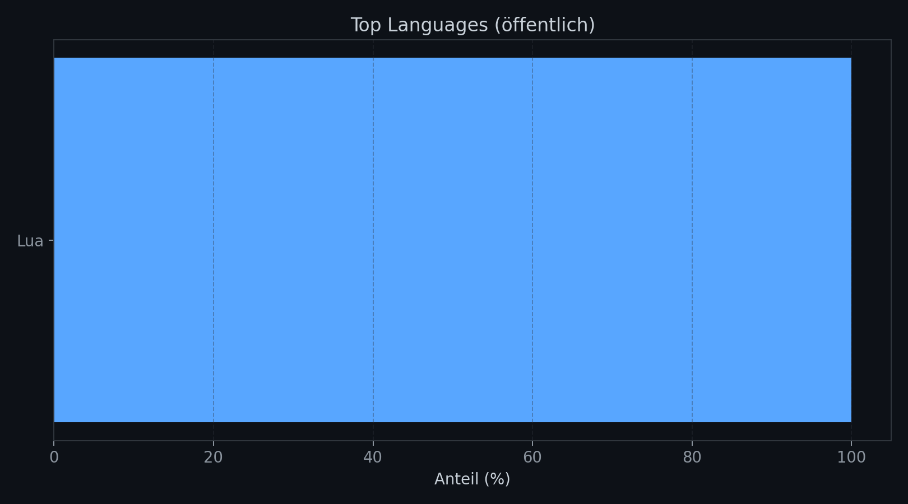
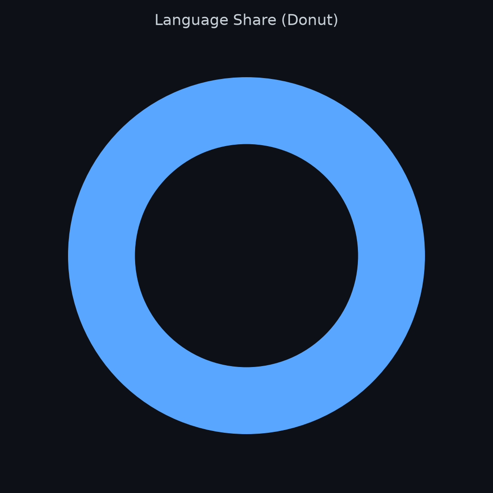

<!-- Banner -->

  <picture>
    <source media="(prefers-color-scheme: light)" srcset="06c5c296-849d-4ba3-b3cd-cd7f7624b58c.png">
    
  </picture>

<!-- Hero / Intro -->

  

<h1 align="center">Mike · PixelGG</h1>

  <b>Game-Backends · Tools · Automatisierung</b> 
  Von Prototypen bis Live-Services – mit Fokus auf Stabilität, saubere Infrastruktur und praktische KI-Features.

  <code>Auth</code> · <code>Matchmaking</code> · <code>Stats</code> · <code>Queues</code> · <code>APIs</code>

  
  
  

 

---

## 🔎 Snapshot & Fokus

  <!-- start: metrics-summary -->

Repos: <b>0</b> · Stars (gesamt): <b>0</b> · Top Language: —

<!-- end: metrics-summary -->

 

<table>
  <tr>
    <td width="33%" valign="top">
      <b>🎮 Game-Backends</b> 
      Server-authoritative Systeme für Auth, Matchmaking, Stat-Tracking & Economy – gebaut für Live-Operations.
    </td>
    <td width="33%" valign="top">
      <b>🤖 Automatisierung</b> 
      Discord-Bots, Worker und Services, die Deployments, Monitoring und Community-Workflows automatisieren.
    </td>
    <td width="33%" valign="top">
      <b>🧠 KI im Alltag</b> 
      Tools, die KI dort einsetzen, wo sie wirklich hilft: beim Entwickeln, Operaten und Verwalten von Game-Ökosystemen.
    </td>
  </tr>
</table>

 

---

## 🚀 Projekte · Dashboard

  <b>Aktuell aktiv</b> 
  Zuletzt geänderte Repositories (Top 6, automatisch generiert).

<!-- start: projects-latest -->

<i>Keine öffentlichen Repositories.</i>

<!-- end: projects-latest -->

  

  <b>Beliebt</b> 
  Repositories mit den meisten Stars (Top 6, automatisch generiert).

<!-- start: projects-stars -->

<i>Keine öffentlichen Repositories.</i>

<!-- end: projects-stars -->

 

---

## 🧰 Tech-Stack

  <b>Core & Scripting</b> 
  

  <b>Backend & Daten</b> 
  

  <b>Build, Infra & Automation</b> 
   
  <code>YAML</code> für Pipelines & Configs

 

---

## 📊 Tech-Insights

  Language-Mix über deine öffentlichen Repositories – lokal gerendert.

  
  

 

---

## 🎯 Was gerade wichtig ist

<table>
  <tr>
    <td width="50%" valign="top">
      <b>🔐 Live-Backends für Games</b>
      <ul>
        <li>Auth & Session-Handling</li>
        <li>Matchmaking & Instancing</li>
        <li>Stats, Events & Progression</li>
      </ul>
    </td>
    <td width="50%" valign="top">
      <b>⚙️ Dev-Automation & Tools</b>
      <ul>
        <li>Services & Bots für CI/CD & Monitoring</li>
        <li>Discord-Integration für Studio & Community</li>
        <li>KI-unterstützte Workflows für Devs & Ops</li>
      </ul>
    </td>
  </tr>
</table>

 

---

## 📫 Kontakt

  

