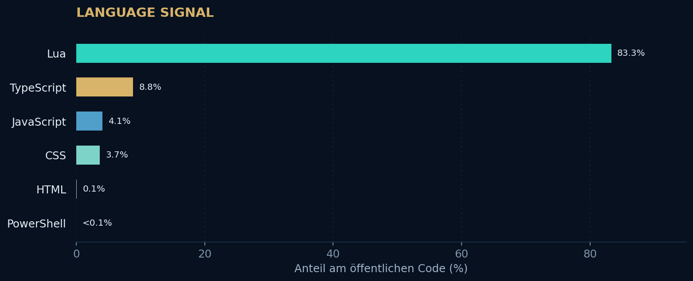

  

<h1 align="center">MIKE <code>//</code> PIXELGG</h1>

  <strong>Ich baue die Schicht, die Spieler niemals bemerken sollten — weil sie zuverlässig funktioniert.</strong>

  Serverautoritative Game-Systeme, sichere Datenflüsse und operative Werkzeuge 
  für FiveM, Live-Services und anspruchsvolle Community-Plattformen.

  
  
  

  <code>Lua</code>
  <code>TypeScript</code>
  <code>React</code>
  <code>FiveM</code>
  <code>MySQL</code>
  <code>Automation</code>
  <code>Operations</code>

 

<table>
  <tr>
    <td>
      <strong>OPERATING PRINCIPLE</strong>  
      <code>CLIENTS REQUEST&nbsp;&nbsp;·&nbsp;&nbsp;SERVERS DECIDE&nbsp;&nbsp;·&nbsp;&nbsp;OPERATIONS PROVE</code>  
      
        Gute Systeme schützen ihre Grenzen, erklären ihren Zustand und bleiben auch dann beherrschbar,
        wenn etwas nicht nach Plan läuft.
      
    </td>
  </tr>
</table>

## `01 // SYSTEMSIGNATUR`

<table>
  <tr>
    <td width="50%" valign="top">
      <strong>Was ich baue</strong>  
      
        Serverautoritative Game-Plattformen, versionierte Schnittstellen, transaktionale Fachsysteme,
        Worker, Bots und interne Werkzeuge für echte Betriebsabläufe.
      
    </td>
    <td width="50%" valign="top">
      <strong>Wofür ich optimiere</strong>  
      
        Klare Ownership, Default-Deny, begrenzte Laufzeitkosten, nachvollziehbare Migrationen,
        aussagekräftige Telemetrie und kontrollierbare Recovery.
      
    </td>
  </tr>
  <tr>
    <td width="50%" valign="top">
      <strong>Wie ich entwickle</strong>  
      
        Architektur, Sicherheitsgrenzen, Delivery und Betrieb werden als ein System entworfen —
        nicht als vier nachträgliche Aufgaben.
      
    </td>
    <td width="50%" valign="top">
      <strong>Wann Automatisierung gewinnt</strong>  
      
        Wenn sie wiederholbare Arbeit entfernt, Fehler sichtbar macht und Menschen mehr Raum
        für gute Entscheidungen gibt.
      
    </td>
  </tr>
</table>

## `02 // REQUEST LIFECYCLE`

  <code>PLAYER INTENT</code>
  &nbsp;→&nbsp;
  <code>GUARDED GATEWAY</code>
  &nbsp;→&nbsp;
  <code>DOMAIN DECISION</code>
  &nbsp;→&nbsp;
  <code>AUDITABLE RESULT</code>

<table>
  <tr>
    <td width="25%" valign="top">
      <strong>01 · Intent</strong>  
      Der Client beschreibt eine Absicht, niemals die Wahrheit.
    </td>
    <td width="25%" valign="top">
      <strong>02 · Guard</strong>  
      Session, Schema, Rate, Rechte und Zustand werden geprüft.
    </td>
    <td width="25%" valign="top">
      <strong>03 · Commit</strong>  
      Die Domäne entscheidet und persistiert atomar.
    </td>
    <td width="25%" valign="top">
      <strong>04 · Proof</strong>  
      Audit, Health und Telemetrie machen das Ergebnis erklärbar.
    </td>
  </tr>
</table>

## `03 // FLAGSHIP SYSTEMS`

<table>
  <tr>
    <td width="50%" valign="top">
      <strong>◈ <a href="https://github.com/PixelGG/Arvox_Core">Arvox Core</a></strong>  
      
        Der gehärtete Mittelpunkt des Ökosystems: Accounts, Sessions, Characters, Permissions,
        versionierte Requests, Audit, Outbox und Health — mit bewusst kleiner Angriffsfläche.
        
      <code>Lua</code> <code>FiveM</code> <code>Security</code> <code>oxmysql</code>
    </td>
    <td width="50%" valign="top">
      <strong>◇ <a href="https://github.com/PixelGG/Arvox_Inventory">Arvox Inventory</a></strong>  
      
        Ein transaktionssicheres Inventarsystem mit geordneten Locks, Revisionen, Idempotenz,
        atomarem Crafting und einer zugänglichen React-NUI von 720p bis 4K.
        
      <code>Lua</code> <code>React</code> <code>TypeScript</code> <code>InnoDB</code>
    </td>
  </tr>
  <tr>
    <td width="50%" valign="top">
      <strong>◎ <a href="https://github.com/PixelGG/Arvox_Phone">Arvox Pulse</a></strong>  
      
        Kein Menü in Telefonform, sondern ein persistentes Gerät: Calls, Messaging, Media,
        GPS, Social, Marketplace und ein erweiterbares App-SDK auf serverautoritativer Basis.
        
      <code>PulseOS</code> <code>React</code> <code>Lua</code> <code>App SDK</code>
    </td>
    <td width="50%" valign="top">
      <strong>⌁ <a href="https://github.com/PixelGG/DXForge">DXForge</a></strong>  
      
        Eine eigenständige DX9-Lua-UI-Bibliothek mit Windowing, Controls, Themes,
        Animationen, Tooltips, Notifications und fallback-sicherem Rendering.
        
      <code>Lua 5.1</code> <code>DX9</code> <code>UI Systems</code> <code>MIT</code>
    </td>
  </tr>
</table>

## `04 // LIVE TELEMETRY`

<!-- start: metrics-summary -->

Public Repositories: <b>5</b> · Primary Signal: <b>Lua</b> (83.3%)

<!-- end: metrics-summary -->

  

  
    Automatisch aus den öffentlichen Repositories erzeugt · tägliche Aktualisierung via GitHub Actions
  

## `05 // RECENT TRANSMISSIONS`

  Die zuletzt bewegten öffentlichen Systeme — direkt aus der GitHub API.

<!-- start: projects-latest -->

<table>
<tr><td align="left" valign="top" width="50%"><a href="https://github.com/PixelGG/Arvox_Inventory"><b>Arvox_Inventory</b></a> Transaktionssicheres Inventarsystem für Arvox Core. Lua · zuletzt aktiv 2026-07-26</td><td align="left" valign="top" width="50%"><a href="https://github.com/PixelGG/Arvox_Phone"><b>Arvox_Phone</b></a> Gerätebasiertes, serverautorisiertes FiveM-Phone mit PulseOS. Lua · zuletzt aktiv 2026-07-25</td></tr>
<tr><td align="left" valign="top" width="50%"><a href="https://github.com/PixelGG/Arvox_Core"><b>Arvox_Core</b></a> Sicherer FiveM-Kern für Accounts, Sessions, Characters und Permissions. Lua · zuletzt aktiv 2026-07-25</td><td align="left" valign="top" width="50%"><a href="https://github.com/PixelGG/DXForge"><b>DXForge</b></a> Strukturierte DX9-Lua-UI-Bibliothek für hochwertige In-Game-Overlays. Lua · zuletzt aktiv 2026-07-02</td></tr>
<tr><td align="left" valign="top" width="50%"><a href="https://github.com/PixelGG/LuaScripts"><b>LuaScripts</b></a> Experimentierfeld und Sammlung wiederverwendbarer Lua-Systeme. Lua · zuletzt aktiv 2026-06-09</td><td width="50%"></td></tr>
</table>

<!-- end: projects-latest -->

## `06 // TOOLCHAIN`

<table>
  <tr>
    <td width="33%" valign="top">
      <strong>Runtime</strong>  
      Lua · TypeScript · JavaScript · Node.js · React
    </td>
    <td width="33%" valign="top">
      <strong>State & Data</strong>  
      MySQL · MariaDB · InnoDB · oxmysql · JSON contracts
    </td>
    <td width="33%" valign="top">
      <strong>Delivery & Ops</strong>  
      Git · GitHub Actions · Docker · CI/CD · structured logging
    </td>
  </tr>
</table>

  

 

<table>
  <tr>
    <td align="center">
      <strong>Hast du ein Systemproblem, das mehr als nur einen schnellen Patch verdient?</strong>  
      
        Dann lass uns über Grenzen, Datenflüsse, Betrieb und die eigentliche Ursache sprechen.
        
      <a href="https://github.com/PixelGG/PixelGG/issues/new"><strong>OPEN A CHANNEL →</strong></a>
      &nbsp;&nbsp;·&nbsp;&nbsp;
      <a href="https://github.com/PixelGG?tab=repositories"><strong>EXPLORE SYSTEMS →</strong></a>
    </td>
  </tr>
</table>

  <code>DESIGNED FOR FAILURE · BUILT FOR RECOVERY · DOCUMENTED FOR HUMANS</code>

