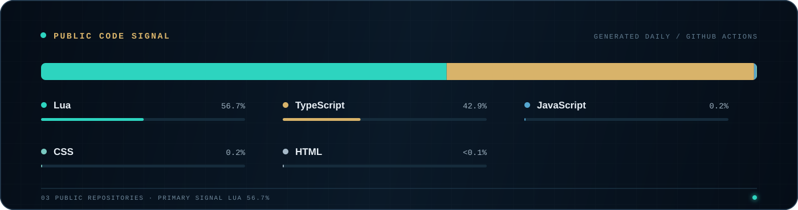
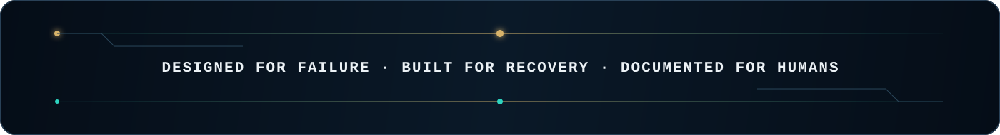

  

  <a href="https://github.com/PixelGG?tab=repositories"><strong>EXPLORE SYSTEMS</strong></a>
  &nbsp;&nbsp;·&nbsp;&nbsp;
  <a href="https://github.com/PixelGG/PixelGG/issues/new"><strong>OPEN A CHANNEL</strong></a>
  &nbsp;&nbsp;·&nbsp;&nbsp;
  <a href="https://github.com/PixelGG"><strong>FOLLOW THE SIGNAL</strong></a>

 

<table>
  <tr>
    <td width="33%" valign="top">
      POSITION  
      <strong>Systems Engineer</strong> 
      Game-Plattformen, Backends und operative Werkzeuge.
    </td>
    <td width="33%" valign="top">
      FOCUS  
      <strong>Authority & Reliability</strong> 
      Sichere Grenzen, transaktionale Daten und kontrollierbare Zustände.
    </td>
    <td width="33%" valign="top">
      STANDARD  
      <strong>Built to operate</strong> 
      Beobachtbar, versioniert, dokumentiert und für Recovery entworfen.
    </td>
  </tr>
</table>

## System profile

Ich entwickle nicht nur Funktionen, sondern die Regeln, Grenzen und Betriebswege, durch die ein System langfristig verlässlich bleibt. Der Client beschreibt eine Absicht. Die Serverdomäne entscheidet. Audit und Telemetrie halten fest, was tatsächlich geschah.

<table>
  <tr>
    <td width="25%" valign="top">
      <strong>◈ Authority</strong>  
      Kritischer Zustand gehört auf den Server, nicht in die Darstellungsschicht.
    </td>
    <td width="25%" valign="top">
      <strong>◇ Contracts</strong>  
      Schnittstellen sind explizit, versioniert und bewusst begrenzt.
    </td>
    <td width="25%" valign="top">
      <strong>◎ Evidence</strong>  
      Entscheidungen bleiben durch Audit, Health und Logs erklärbar.
    </td>
    <td width="25%" valign="top">
      <strong>⌁ Recovery</strong>  
      Fehler werden isoliert, sichtbar gemacht und kontrolliert behoben.
    </td>
  </tr>
</table>

  <code>CLIENT INTENT</code>
  &nbsp;→&nbsp;
  <code>TRUST GATE</code>
  &nbsp;→&nbsp;
  <code>DOMAIN COMMIT</code>
  &nbsp;→&nbsp;
  <code>AUDITABLE RESULT</code>

## Selected systems

<table>
  <tr>
    <td width="50%" valign="top">
      FOUNDATION / SECURITY  
      <strong>◈ <a href="https://github.com/PixelGG/Arvox_Core">Arvox Core</a></strong>  
      
        Der gehärtete Mittelpunkt des Arvox-Ökosystems: Accounts, Sessions, Characters,
        Permissions, versionierte Requests, Audit, Outbox und Health.
        
      <code>Lua</code> <code>Server Authority</code> <code>Security</code> <code>oxmysql</code>
    </td>
    <td width="50%" valign="top">
      TRANSACTIONS / STATE  
      <strong>◇ <a href="https://github.com/PixelGG/Arvox_Inventory">Arvox Inventory</a></strong>  
      
        Transaktionssicheres Inventar mit geordneten Locks, Revisionen, Idempotenz,
        atomarem Crafting und einer responsiven React-Oberfläche.
        
      <code>Lua</code> <code>React</code> <code>TypeScript</code> <code>InnoDB</code>
    </td>
  </tr>
  <tr>
    <td width="50%" valign="top">
      DEVICE PLATFORM / PRODUCT  
      <strong>◎ <a href="https://github.com/PixelGG/Arvox_Phone">Arvox Pulse</a></strong>  
      
        Persistente Geräteplattform mit Calls, Messaging, Media, GPS, Social,
        Marketplace und einem erweiterbaren App-SDK.
        
      <code>PulseOS</code> <code>React</code> <code>Lua</code> <code>App SDK</code>
    </td>
    <td width="50%" valign="top">
      UI INFRASTRUCTURE / OPEN SOURCE  
      <strong>⌁ <a href="https://github.com/PixelGG/DXForge">DXForge</a></strong>  
      
        Strukturierte Lua-UI-Bibliothek mit Windowing, Controls, Themes,
        Animationen, Tooltips, Notifications und fallback-sicherem Rendering.
        
      <code>Lua 5.1</code> <code>UI Systems</code> <code>Animation</code> <code>MIT</code>
    </td>
  </tr>
</table>

## Live signal

  

<!-- start: metrics-summary -->

<b>3</b> Public Repositories · Primary Signal <b>Lua</b> 70.9% · updated daily

<!-- end: metrics-summary -->

## Engineering surface

<table>
  <tr>
    <td width="33%" valign="top">
      RUNTIME  
      <code>Lua</code> <code>TypeScript</code> <code>JavaScript</code>  
      Domänenlogik, Services, Worker und Integrationen.
    </td>
    <td width="33%" valign="top">
      STATE & DATA  
      <code>MySQL</code> <code>MariaDB</code> <code>InnoDB</code>  
      Transaktionen, Migrationen, Revisionsmodelle und Persistenz.
    </td>
    <td width="33%" valign="top">
      DELIVERY & OPS  
      <code>Docker</code> <code>GitHub Actions</code> <code>Node.js</code>  
      Reproduzierbare Builds, Automatisierung und strukturierte Telemetrie.
    </td>
  </tr>
</table>

## Repository feed

  Die zuletzt bewegten öffentlichen Systeme, automatisch über die GitHub API aktualisiert.

<!-- start: projects-latest -->

<table>
<tr><td align="left" valign="top" width="50%"><code>Lua · 2026-08-22</code>  <a href="https://github.com/PixelGG/Synex_Framework"><b>Synex_Framework</b></a> ⚡ **Synex** — A modern, modular &amp; extensible FiveM framework built for performance, scalability and clean developme…  <a href="https://github.com/PixelGG/Synex_Framework">OPEN REPOSITORY →</a></td><td align="left" valign="top" width="50%"><code>Lua · 2026-07-02</code>  <a href="https://github.com/PixelGG/DXForge"><b>DXForge</b></a> Strukturierte DX9-Lua-UI-Bibliothek für hochwertige In-Game-Overlays.  <a href="https://github.com/PixelGG/DXForge">OPEN REPOSITORY →</a></td></tr>
<tr><td align="left" valign="top" width="50%"><code>Lua · 2026-06-09</code>  <a href="https://github.com/PixelGG/LuaScripts"><b>LuaScripts</b></a> Experimentierfeld und Sammlung wiederverwendbarer Lua-Systeme.  <a href="https://github.com/PixelGG/LuaScripts">OPEN REPOSITORY →</a></td><td width="50%"></td></tr>
</table>

<!-- end: projects-latest -->

 

<table>
  <tr>
    <td align="center">
      COLLABORATION CHANNEL  
      <strong>Ein schwieriges Systemproblem ist ein guter Gesprächseinstieg.</strong>  
      
        Wenn es um belastbare Services, sichere Datenflüsse oder operative Werkzeuge geht,
        öffne ein Issue mit Kontext und Ziel.
        
      <a href="https://github.com/PixelGG/PixelGG/issues/new"><strong>OPEN A CHANNEL →</strong></a>
    </td>
  </tr>
</table>

 

  

