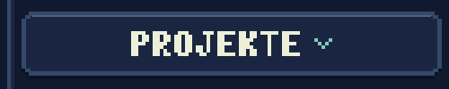
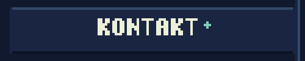
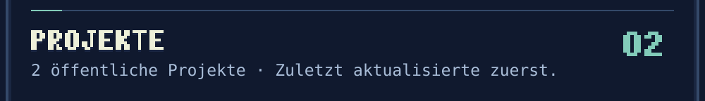
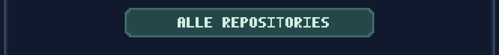
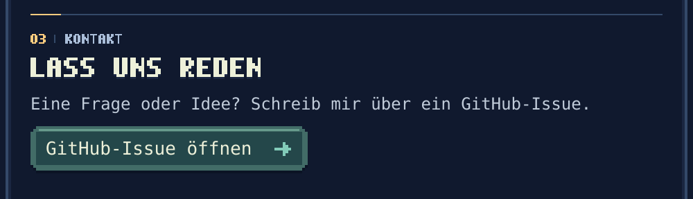
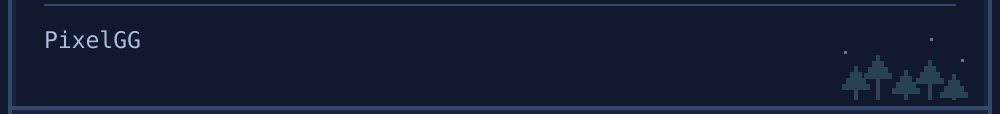

<!-- Generated by .github/scripts/render_profile.py. Edit config.json or the renderer, not this file. -->

<picture><source media="(max-width: 600px)" srcset="./.github/assets/world-mobile.svg"></picture><a href="#projekte"><picture><source media="(max-width: 600px)" srcset="./.github/assets/nav-workbench-mobile.svg"></picture></a><a href="#kontakt"><picture><source media="(max-width: 600px)" srcset="./.github/assets/nav-contact-mobile.svg"></picture></a><picture><source media="(max-width: 600px)" srcset="./.github/assets/intro-mobile.svg"></picture><picture><source media="(max-width: 600px)" srcset="./.github/assets/workbench-mobile.svg"></picture><a href="https://github.com/PixelGG/Synex_Framework"><picture><source media="(max-width: 600px)" srcset="./.github/assets/projects/1342344809-mobile.svg"></picture></a><a href="https://github.com/PixelGG/DXForge"><picture><source media="(max-width: 600px)" srcset="./.github/assets/projects/1267389937-mobile.svg"></picture></a><a href="https://github.com/PixelGG?tab=repositories"><picture><source media="(max-width: 600px)" srcset="./.github/assets/catalog-mobile.svg"></picture></a><a href="https://github.com/PixelGG/PixelGG/issues/new"><picture><source media="(max-width: 600px)" srcset="./.github/assets/contact-mobile.svg"></picture></a><picture><source media="(max-width: 600px)" srcset="./.github/assets/endcap-mobile.svg"></picture>

<samp>Textansicht</samp>

<h2>Mike / PixelGG</h2>

Ich entwickle Systeme für Spiele, eigene Oberflächen und Werkzeuge zur Automatisierung.

<h3><a href="https://github.com/PixelGG/Synex_Framework">Synex_Framework</a></h3>

⚡ Synex — A modern, modular &amp; extensible FiveM framework built for performance, scalability and clean development. Powered by a robust core and a growing ecosystem of official resources — from characters, inventory &amp; banking to phones, radio, vehicles, jobs and beyond.

Lua · Letzter Push 31.08.2026

<h3><a href="https://github.com/PixelGG/DXForge">DXForge</a></h3>

DXForge is a DX9 Lua UI library focused on building customizable in-game overlay interfaces with draggable windows, tabs, groupboxes, buttons, toggles, sliders, keybinds, color pickers, notifications, tooltips, themes, and reusable UI components.

Lua · Letzter Push 02.07.2026

<a href="https://github.com/PixelGG?tab=repositories">Alle Repositories</a> · <a href="https://github.com/PixelGG/PixelGG/issues/new">Kontakt aufnehmen</a>

