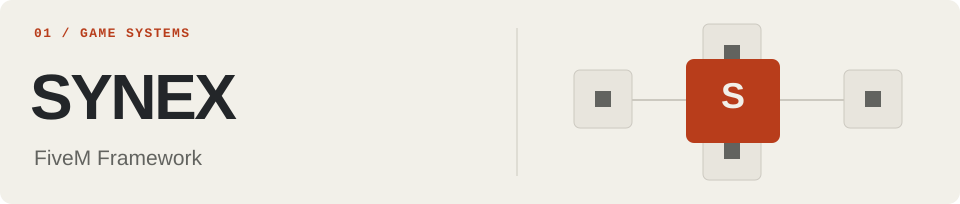
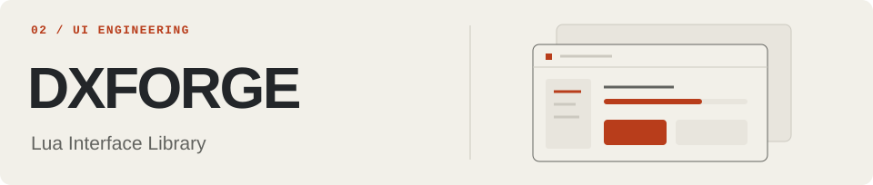
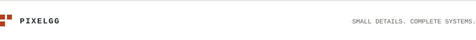

<picture>
  <source media="(max-width: 600px) and (prefers-color-scheme: dark)" srcset="./.github/assets/hero-mobile-dark.svg">
  <source media="(max-width: 600px)" srcset="./.github/assets/hero-mobile-light.svg">
  <source media="(prefers-color-scheme: dark)" srcset="./.github/assets/hero-dark.svg">
  
</picture>

 

**Ich bin Mike.** Ich entwickle Game-Systeme, Lua-Oberflächen und Werkzeuge für ihre Entwicklung. Mich interessiert das Zusammenspiel: wie sich ein Interface anfühlt, wie Daten durch ein System laufen und was passiert, wenn etwas schiefgeht.

[Projekte ansehen](#ausgewählte-projekte) &nbsp; / &nbsp; [Alle Repositories](https://github.com/PixelGG?tab=repositories) &nbsp; / &nbsp; [Kontakt aufnehmen](https://github.com/PixelGG/PixelGG/issues/new)

 

## Ausgewählte Projekte

### 01 — SYNEX

<a href="https://github.com/PixelGG/Synex_Framework">
  <picture>
    <source media="(prefers-color-scheme: dark)" srcset="./.github/assets/synex-dark.svg">
    
  </picture>
</a>

Ein eigenes FiveM-Framework mit serverseitiger Zustandsverwaltung, klaren Berechtigungen und versionierten Schnittstellen. Der Kern trennt Accounts, Sessions und Charaktere; Werkzeuge und Dokumentation gehören zur Entwicklung dazu.

**Entwicklungsstand:** Der Core hat einen dokumentierten Production-Beta-Stand für eine festgelegte Umgebung. Weitere Module sind experimentell und werden getrennt geprüft.

`Lua` · `TypeScript` · `MariaDB`

[Code ansehen ↗](https://github.com/PixelGG/Synex_Framework) &nbsp; · &nbsp; [Architektur](https://github.com/PixelGG/Synex_Framework/tree/main/docs/architecture) &nbsp; · &nbsp; [Release-Stand](https://github.com/PixelGG/Synex_Framework/blob/main/docs/release-readiness.md)

 

### 02 — DXForge

<a href="https://github.com/PixelGG/DXForge">
  <picture>
    <source media="(prefers-color-scheme: dark)" srcset="./.github/assets/dxforge-dark.svg">
    
  </picture>
</a>

Eine eigene Lua-Bibliothek für DX9-Oberflächen: Fenster, Eingaben, Themes, Animationen und Benachrichtigungen als wiederverwendbare Bausteine. Mit zentralem Input-Handling, Fensterreihenfolge und einem gemeinsamen Render-Zyklus.

**Im Fokus:** konsistentes Verhalten und eine Oberfläche, die sich bis ins Detail gestalten lässt.

`Lua 5.1` · `DX9` · `UI Systems`

[Code ansehen ↗](https://github.com/PixelGG/DXForge) &nbsp; · &nbsp; [Komponenten](https://github.com/PixelGG/DXForge/blob/main/docs/components.md) &nbsp; · &nbsp; [Beispiele](https://github.com/PixelGG/DXForge/blob/main/docs/examples.md)

 

## Worauf ich Wert lege

**Ein Interface muss sich richtig anfühlen.** Abstände, Rückmeldungen und Eingaben sind Teil der Funktion.

**Zustand braucht einen klaren Besitzer.** Kritische Entscheidungen gehören in die zuständige Domäne; Schnittstellen machen die Grenzen sichtbar.

**Fehler müssen erklärbar sein.** Verständliche Logs, nachvollziehbare Abläufe und brauchbare Dokumentation helfen beim Weiterbauen.

  
<strong>Werkzeuge & Umsetzung dieses Profils</strong>

Je nach Aufgabe arbeite ich mit Lua, TypeScript, JavaScript, React, Node.js und relationalen Datenbanken. Die Wahl folgt dem System, das entstehen soll.

Dieses Profil verwendet selbst gezeichnete SVGs und natives Markdown. Ein kleiner Python-Generator erzeugt die Grafiken offline mit der Standardbibliothek. Es gibt keine externen Bild-Widgets, Schrift-Downloads oder Statistikdienste. Helle und dunkle Varianten sowie ein eigenes mobiles Titelbild liegen direkt im Repository.

[Generator ansehen](./.github/scripts/render_profile.py) · [Gestaltung & Pflege](./docs/profile-design.md)

 

**Du baust an etwas Ähnlichem?** [Schreib mir](https://github.com/PixelGG/PixelGG/issues/new), woran du arbeitest und wo es hakt.

 

<picture>
  <source media="(prefers-color-scheme: dark)" srcset="./.github/assets/footer-dark.svg">
  
</picture>
