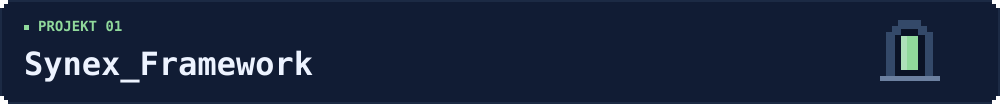
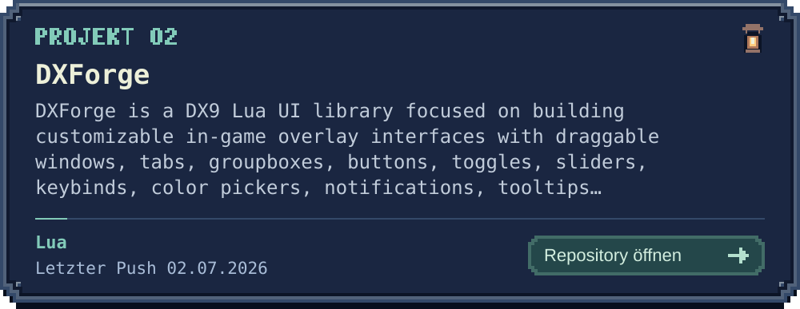

<!-- Generated by .github/scripts/render_profile.py. Edit config.json or the renderer, not this file. -->

<picture>
  <source media="(max-width: 600px)" srcset="./.github/assets/world-mobile.svg">
  
</picture>

<h2 align="center">Mike / PixelGG</h2>

Ich entwickle Systeme für Spiele, eigene Oberflächen und Werkzeuge zur Automatisierung.

<a href="https://github.com/PixelGG?tab=repositories">Alle Repositories ↗</a> &nbsp; · &nbsp; <a href="https://github.com/PixelGG/PixelGG/issues/new">Kontakt aufnehmen ↗</a>

## Auf der Werkbank

<strong>02 Projekte</strong> &nbsp; / &nbsp; Öffentlich &amp; aktiv &nbsp; / &nbsp; Neueste Arbeit zuerst

<table width="100%">
<tr><td>
<a href="https://github.com/PixelGG/Synex_Framework">
  <picture>
    <source media="(max-width: 600px)" srcset="./.github/assets/projects/1342344809-mobile.svg">
    
  </picture>
</a>

⚡ Synex — A modern, modular &amp; extensible FiveM framework built for performance, scalability and clean development. Powered by a robust core and a growing ecosystem of official resources — from characters, inventory…

<code>Lua</code> &nbsp; · &nbsp; Letzter Push 31.08.2026

<a href="https://github.com/PixelGG/Synex_Framework"><strong>Repository öffnen ↗</strong></a>

</td></tr>
</table>

<table width="100%">
<tr><td>
<a href="https://github.com/PixelGG/DXForge">
  <picture>
    <source media="(max-width: 600px)" srcset="./.github/assets/projects/1267389937-mobile.svg">
    
  </picture>
</a>

DXForge is a DX9 Lua UI library focused on building customizable in-game overlay interfaces with draggable windows, tabs, groupboxes, buttons, toggles, sliders, keybinds, color pickers, notifications, tooltips…

<code>Lua</code> &nbsp; · &nbsp; Letzter Push 02.07.2026

<a href="https://github.com/PixelGG/DXForge"><strong>Repository öffnen ↗</strong></a>

</td></tr>
</table>

<a href="https://github.com/PixelGG?tab=repositories">Alle Repositories ansehen →</a>

---

<strong>Eine Idee oder eine Frage?</strong> <a href="https://github.com/PixelGG/PixelGG/issues/new">Lass uns darüber sprechen ↗</a>

